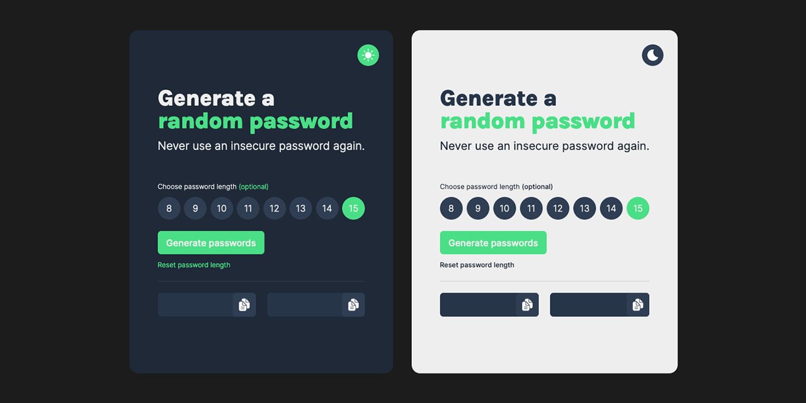

# Password Generator

 

## Table of contents

- [Overview](#overview)
  - [Description](#description)
  - [Links](#links)
- [My Process](#my-process)
  - [Built with](#built-with)
  - [Acknowledgements and Resources](#acknowledgements0-and-resources) 
- [Author](#author)

## Overview

### Description
A simple password app that allows users to generate random passwords of varying lengths, copy them to the clipboard, and toggle between light and dark themes.

### Links

- [Live Demo](https://password-generator-rouge-rho.vercel.app)

## My Process

### Built with

- Vanilla JS

### Acknowledgements and Resources

- [Scrimba - Learn JavaScript](https://scrimba.com/learn/learnjavascript) - This project was a challenge from the Learn JavaScript course on Scrimba to reinforce JavaScript knowledge.

## Author

- Jesse Adkins, Junior Frontend Developer
- Email: jesse@jesseadkins.com
- [Portfolio](https://www.jesseadkins.com)
- [LinkedIn](https://www.linkedin.com/in/adkinsjesse)
- [Frontend Mentor](https://www.frontendmentor.io/profile/jessadk)

